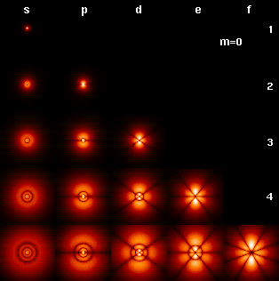
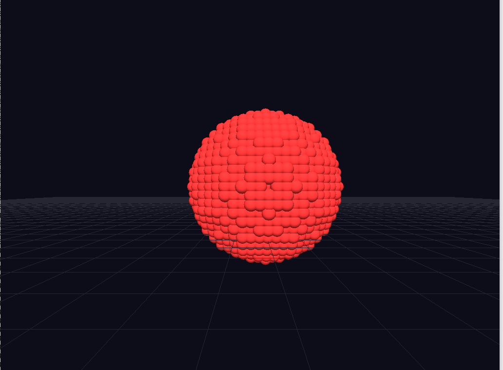
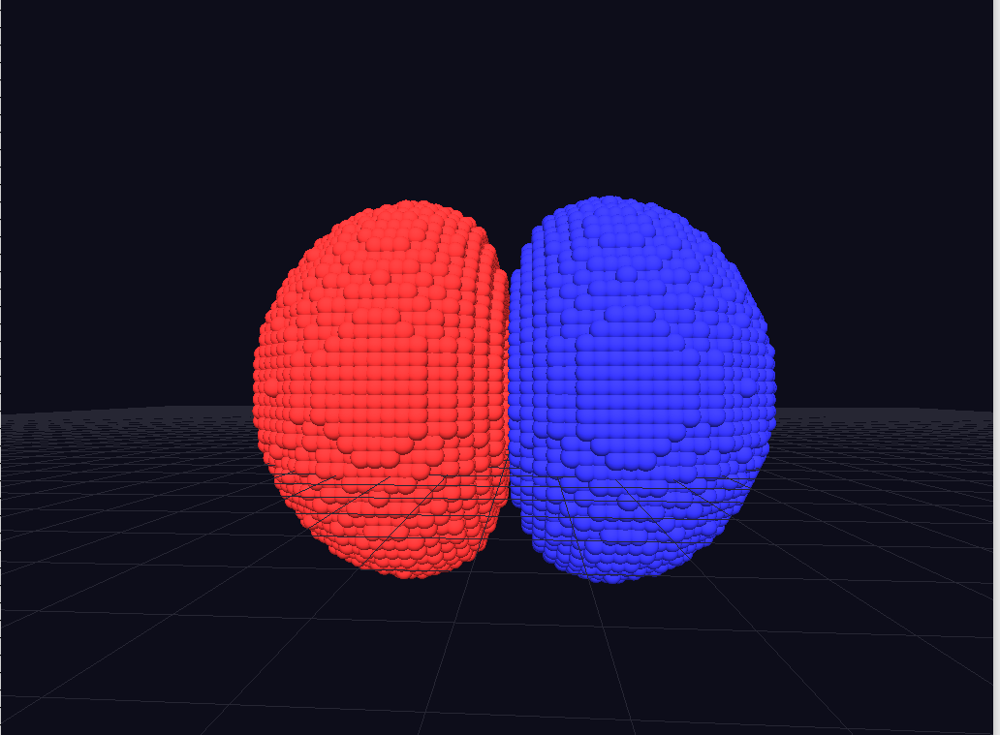
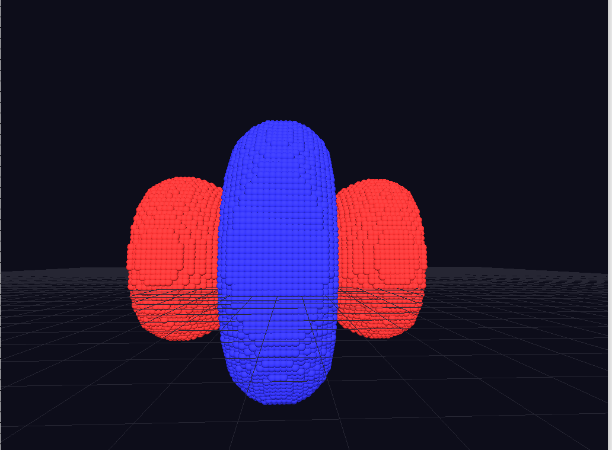
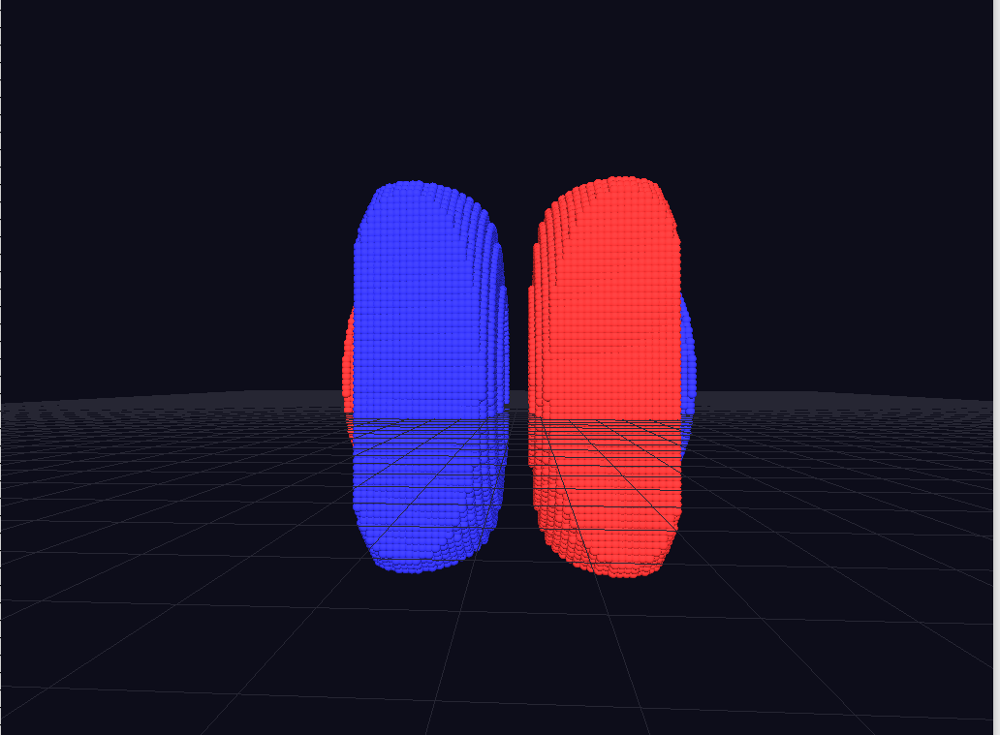
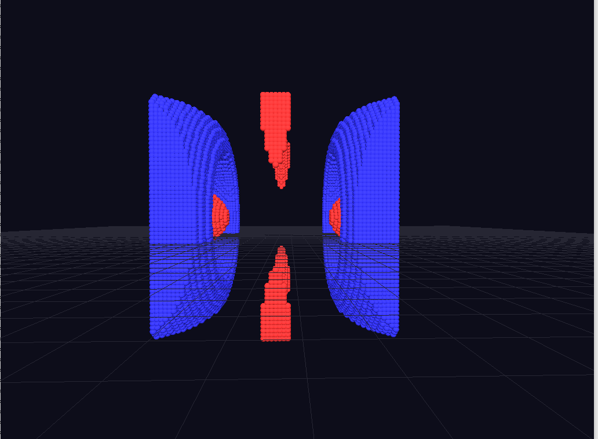

# Hydrogen orbitals

## Someone said:

  

## I mean, it's trivial

<table>
  <tr>
    <td align="center">
       
      <b>1s</b>
    </td>
    <td align="center">
       
      <b>2p</b>
    </td>
    <td align="center">
       
      <b>3d</b>
    </td>
  </tr>
  <tr>
    <td align="center">
       
      <b>4e</b>
    </td>
    <td align="center">
       
      <b>5f</b>
    </td>
  </tr>
</table>
